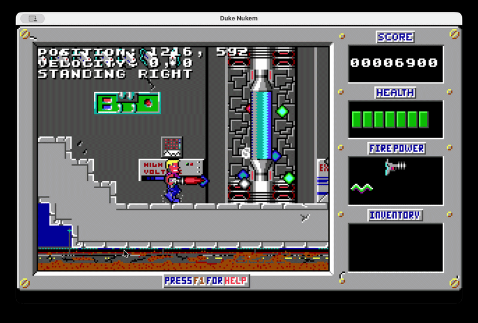

# Duke Nukem

This project is a **Java-based recreation of the original EGA platformer**, released in **1991** for DOS.

If you are looking at this repository while following the Let's Code Duke Nukem YouTube series, the code for each episode can be accessed through the tags `episode-1 ... episode-35`. Simply check out the tag that matches the episode.

While still work in progress, the first episode is fully playable with all enemies, sounds and pickups implemented.

# Running the Game
You can run the game by running `./gradlew run` in the terminal. This will download the shareware episode for you to play.
If you want to enable cheat mode, pass in `asp`: `./gradlew run --args="asp"`

# Screenshots

# Why another port?
While there are probably better versions of the game out there, I wanted to create a pure Java port without any libraries (apart from testing) just for fun.

I will add a list of known issues and work on support for the remaining episodes.
